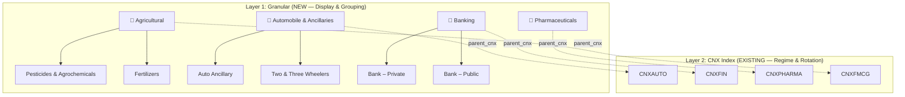

# Granular Sector Taxonomy — Implementation Plan

## Problem

Currently, every stock is mapped to **one of 12 CNX sector indices** (CNXAUTO, CNXIT, CNXFIN, etc.) using a crude keyword match against yfinance's `industry` field. This causes:

1. **Coarse grouping** — "Bank – Private" and "Insurance – Life" both map to `CNXFIN`
2. **Missing sectors** — Agriculture, Chemicals, Textiles, Cement, Power, Defence, etc. don't have their own CNX index
3. **Heavy "OTHERS" bucket** — stocks that don't match any keyword get dumped into `OTHERS` with no sector intelligence

## Proposed Solution: Dual-Layer Sector Architecture



### How It Works

| Layer | Field | Purpose | Example |
|---|---|---|---|
| **Granular Sector** | `granular_sector` | Display name for UI grouping | `"Banking"` |
| **Granular Sub-Sector** | `granular_subsector` | Specific industry classification | `"Bank – Private"` |
| **CNX Index** | `sector_index` | **Unchanged** — used for regime, rotation, filtering | `"CNXFIN"` |

> [!IMPORTANT]
> **The existing pipeline is NOT broken.** The `sector_index` field continues to drive sector regime (LEADING/IMPROVING/WEAKENING/LAGGING), sector rotation, and VCP filtering. The new `granular_sector` and `granular_subsector` fields are **additive** — they enhance the dashboard and enable finer grouping.

---

## The Granular Sector Taxonomy

Here is the full proposed taxonomy with ~35 sectors, ~150 sub-sectors, and their parent CNX index mappings:

| # | Granular Sector | Sub-Sectors | Parent CNX |
|---|---|---|---|
| 1 | 🌾 Agricultural | Pesticides & Agrochemicals, Aquaculture, Fertilizers, Floriculture, Agriculture, Tea & Coffee | CNXFMCG |
| 2 | 👗 Apparel & Accessories | Diamond & Jewellery, Watches & Accessories, Footwear, Textiles, Leather | CNXFMCG |
| 3 | 🚗 Automobile & Ancillaries | Auto Ancillary, Two & Three Wheelers, Passenger Cars, Tractors, Trucks/LCV, Bearings, Tyres, Dealers, Cycles | CNXAUTO |
| 4 | 🏦 Banking | Bank – Private, Bank – Public | CNXFIN |
| 5 | 🧪 Chemicals | Specialty Chemicals, Dyes & Pigments, Petrochemicals, Chlor-Alkali, Carbon Black | CNXPHARMA |
| 6 | ⚒️ Cement & Construction | Cement, Construction, Infrastructure, Roads & Highways | CNXINFRA |
| 7 | 🏠 Consumer Durables | Air Conditioners, Domestic Appliances, Electronics, Consumer Electronics | CNXFMCG |
| 8 | 🛒 Consumer & Retail | Retailing, E-Commerce, Department Stores, Grocery, FMCG, Tobacco | CNXFMCG |
| 9 | 🏗️ Derived Materials | Abrasives, Castings/Forgings, Ceramics, Fasteners, Glass, Laminates, Packaging, Paints, Plastic Products | CNXINFRA |
| 10 | 🎓 Education | Educational Institutions, Edtech, Training | CNXSERVICE |
| 11 | ⚡ Energy & Power | Oil & Gas, Power Generation, Renewable Energy, Solar, Wind, Coal | CNXENERGY |
| 12 | 🏗️ Engineering | Heavy Electrical, Industrial Machinery, Compressors, Pumps, Equipment | CNXINFRA |
| 13 | 💰 Finance – NBFC | NBFC, Housing Finance, Microfinance, Gold Loans | CNXFIN |
| 14 | 📊 Finance – Capital Markets | Stock Exchanges, Brokers, Asset Management, Wealth Management | CNXFIN |
| 15 | 🛡️ Insurance | Insurance – Life, Insurance – General, Insurance Brokers, Reinsurance | CNXFIN |
| 16 | 💻 IT – Software & Services | IT Services, Software Products, Cloud, SaaS, Digital | CNXIT |
| 17 | 🖥️ IT – Hardware & Electronics | Computer Hardware, Semiconductors, Electronic Components, Cables | CNXIT |
| 18 | 🔩 Metals & Mining | Steel, Aluminium, Copper, Zinc, Iron Ore, Mining, Sponge Iron | CNXMETAL |
| 19 | 🎬 Media & Entertainment | Broadcasting, Entertainment, Publishing, Advertising, Digital Media | CNXMEDIA |
| 20 | 💊 Pharmaceuticals | Pharma – Indian, Pharma – MNC, API/Bulk Drugs, CRAMS/CDMO | CNXPHARMA |
| 21 | 🏥 Healthcare | Hospitals, Diagnostics, Medical Devices, Health Information | CNXPHARMA |
| 22 | 📡 Telecom | Telecom Services, Telecom Equipment, ISP, Tower Infrastructure | CNXMEDIA |
| 23 | 🏘️ Real Estate | Residential, Commercial, REITs, Property Management | CNXREALTY |
| 24 | 🧵 Textiles | Cotton, Synthetic, Yarn, Fabric, Garments, Home Textiles | CNXFMCG |
| 25 | 🚢 Logistics & Transport | Shipping, Logistics, Ports, Airlines, Railways, Warehousing | CNXAUTO |
| 26 | 📰 Paper & Printing | Paper, Printing, Stationery | CNXMETAL |
| 27 | 🔋 Electrical & Electronics | Electrical Equipment, Cables, Wires, Switchgears, Transformers, Batteries | CNXENERGY |
| 28 | 🛡️ Defence | Defence Equipment, Aerospace, Ordnance, Shipbuilding | CNXINFRA |
| 29 | 🧴 Personal Care & FMCG | Household Products, Personal Care, Home Care, Oral Care | CNXFMCG |
| 30 | 🏨 Hotels & Tourism | Hotels, Resorts, Travel, Tourism, Restaurants | CNXSERVICE |
| 31 | 🧫 Specialty & Diversified | Conglomerates, Diversified, Trading, Miscellaneous | CNXSERVICE |
| 32 | 🚰 Utilities | Water, Gas Distribution, Regulated Utilities | CNXENERGY |
| 33 | 🏛️ PSU & Government | Central PSU, State PSU, PSU Banks | CNXPSUBANK |
| 34 | 🧱 Building Materials | Ceramics, Tiles, Plywood, Laminates, Sanitaryware, Pipes | CNXINFRA |
| 35 | 🔬 Biotech & Life Sciences | Biotechnology, Life Sciences, CRO, Genomics | CNXPHARMA |

---

## How Mapping Works

### Step 1: yfinance → Granular Mapping (Automatic)

When a stock is enriched via `_enrich_symbol()`, yfinance returns an `industry` field (e.g., `"Drug Manufacturers—Specialty & Generic"`). We match this against a comprehensive keyword map:

```python
# New: yfinance industry → (granular_sector, granular_subsector, parent_cnx)
GRANULAR_MAP = {
    "Drug Manufacturers—General": ("Pharmaceuticals", "Pharma – Indian", "CNXPHARMA"),
    "Drug Manufacturers—Specialty & Generic": ("Pharmaceuticals", "Pharma – Indian", "CNXPHARMA"),
    "Banks—Regional": ("Banking", "Bank – Private", "CNXFIN"),
    "Banks—Diversified": ("Banking", "Bank – Public", "CNXFIN"),
    "Auto Parts": ("Automobile & Ancillaries", "Auto Ancillary", "CNXAUTO"),
    "Auto Manufacturers": ("Automobile & Ancillaries", "Passenger Cars", "CNXAUTO"),
    # ... 150+ mappings
}
```

Each stock gets **3 fields** stored in `stock_sector_mapping`:
```json
{
    "symbol": "HDFCBANK",
    "sector": "Financial Services",        // from yfinance (raw)
    "sector_index": "CNXFIN",              // for regime/rotation (UNCHANGED)
    "granular_sector": "Banking",          // NEW: display grouping
    "granular_subsector": "Bank – Private"  // NEW: specific classification
}
```

### Step 2: Handling New / Unknown Stocks

When a new stock is added to the NSE universe and yfinance returns an industry we haven't mapped:

```
1. yfinance returns industry → check GRANULAR_MAP
2. If EXACT match found → use it
3. If NO exact match → fuzzy keyword search against sub-sector names
4. If fuzzy match found → use it
5. If nothing matches → set granular_sector = "Others", 
                          granular_subsector = yfinance industry (raw),
                          sector_index = "OTHERS"
6. Log the unmapped industry for manual review
```

**Unmapped industries** are stored in a `unmapped_industries` MongoDB collection for periodic manual review. You can then add them to the map.

### Step 3: Manual Override

An admin can manually override any stock's sector mapping via a `sector_overrides` collection:

```json
{
    "symbol": "IRFC",
    "granular_sector": "Finance – NBFC",
    "granular_subsector": "Infrastructure Finance",
    "sector_index": "CNXFIN"
}
```

Overrides take precedence over automatic mapping.

---

## Impact on Existing Pipeline

| Component | Impact | Change Required |
|---|---|---|
| `stock_with_sector.py` | **Major** | New `GRANULAR_MAP`, output adds 2 new fields |
| `stock_sector_mapping` collection | **Minor** | 2 new fields added per document |
| `build_sector.py` (Phase 4) | **None** | Still uses 12 CNX indices for OHLCV |
| `sector_strength.py` | **None** | Still computes RS by `sector_index` |
| `sector_regime.py` | **None** | Still classifies by `sector_index` |
| `sector_rotation.py` | **None** | Still ranks by `sector_index` |
| `stock_filtering.py` | **None** | Still filters by `sector_regime` (which is by `sector_index`) |
| `build_fusion.py` | **Minor** | New fields flow through automatically via merge |
| `dashboard.html` | **Enhancement** | Can now group/display by granular sector |
| `stock_service.py` | **Enhancement** | Can aggregate VCP counts by granular sector |

> [!NOTE]
> **Only 1 file changes significantly** (`stock_with_sector.py`). The rest of the pipeline is untouched because `sector_index` remains the same. The new fields are purely additive.

---

## Proposed Changes

### [MODIFY] [stock_with_sector.py](file:///d:/QuantFusion/data/reference/stock_with_sector.py)

- Replace `SECTOR_INDEX_MAP` (industry → CNX index) with `GRANULAR_MAP` (industry → sector + subsector + CNX index)
- Update `_enrich_symbol()` to output `granular_sector` and `granular_subsector`
- Add fuzzy fallback for unmapped industries
- Add unmapped industry logging to MongoDB

### [NEW] `configs/sector_taxonomy.py`

- Central config file containing the full taxonomy: all 35 sectors, their sub-sectors, parent CNX mapping, and the yfinance industry keyword map
- Single source of truth — easy to extend when new industries appear

### [MODIFY] [stock_service.py](file:///d:/QuantFusion/web/services/stock_service.py) (Optional Enhancement)

- Update `get_sector_wise_vcp_counts()` to group by `granular_sector` instead of `sector_index`

### [MODIFY] Dashboard template (Optional Enhancement)

- Show granular sector/subsector in stock tables instead of raw CNX index names

---

## How to Add a New Sector/Sub-Sector Later

1. **Open** `configs/sector_taxonomy.py`
2. **Add** the new sector to the `SECTOR_TAXONOMY` dict
3. **Add** the yfinance industry keyword(s) to the `YFINANCE_INDUSTRY_MAP`
4. **Re-run** `python -m pipelines.build_universe` (or just the sector enrichment step)
5. **Done** — all stocks matching the new keywords will be reclassified

Example: Adding "Electric Vehicles" sub-sector under Automobile:
```python
SECTOR_TAXONOMY["Automobile & Ancillaries"]["subsectors"].append("Electric Vehicles")
YFINANCE_INDUSTRY_MAP["Electric Vehicle Manufacturers"] = (
    "Automobile & Ancillaries", "Electric Vehicles", "CNXAUTO"
)
```

---

## Open Questions

> [!IMPORTANT]
> **Q1:** Should the dashboard VCP table group stocks by `granular_sector` (e.g., "Banking", "Pharma") instead of the raw `sector_index` (e.g., "CNXFIN", "CNXPHARMA")?

> [!IMPORTANT]  
> **Q2:** Do you want to provide the full list of sub-sectors per sector, or should I build the initial taxonomy from yfinance's industry data + the example you provided and you can refine it?

> [!IMPORTANT]
> **Q3:** For the sector rotation heatmap on the dashboard — should it stay at the 12 CNX index level (where we have real price data), or should it also show the granular sectors (where we'd need to compute synthetic returns from constituent stocks)?

---

## Verification Plan

### Automated Tests
- Run pipeline and verify every stock has `granular_sector`, `granular_subsector`, and `sector_index`
- Verify zero stocks fall into "OTHERS" that previously had a CNX mapping
- Verify `sector_regime`, `sector_rotation`, and `final_stock_scores` produce identical results

### Manual Verification
- Spot-check 20 stocks across different sectors
- Verify dashboard shows granular sector labels correctly
- Check `unmapped_industries` collection is empty or contains only truly exotic industries
